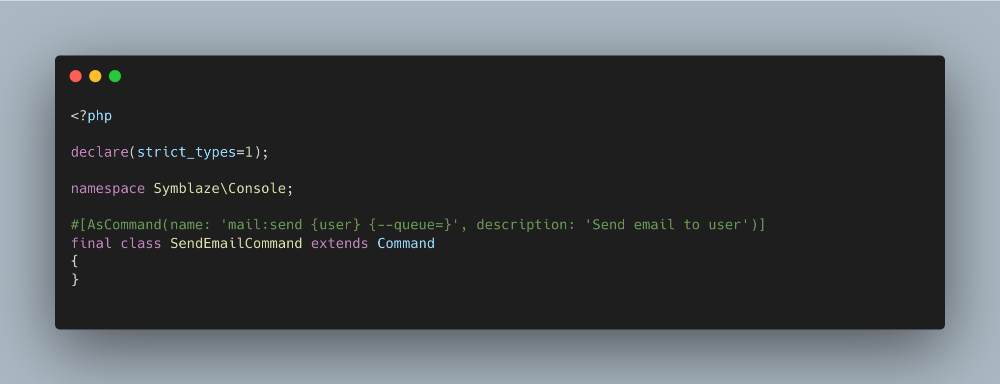

# Symblaze Console

<div align="center">


<a href="https://packagist.org/packages/imdhemy/laravel-purchases">
    
</a>

<a href="https://packagist.org/packages/imdhemy/laravel-purchases/stats">
    
</a>

</div>

Symfony provides a robust console system that simplifies the development of command line interfaces.
However, setting up the console command parameters and options can be somewhat tedious and repetitive.

Symblaze Console is a library that allows you to configure your console commands using the Symfony `AsCommand`
attribute with a fluent interface.



- A single line of code for each command.
- No configuration method.

## Installation

```bash
composer require symblaze/console
```

## Usage

You can find a complete guide on how to use this library in the [documentation](/docs).

## License

Symblaze Console is open-sourced software licensed under the [MIT license](LICENSE).
