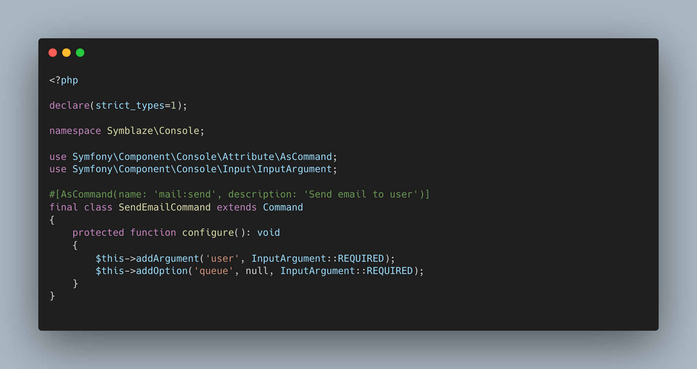
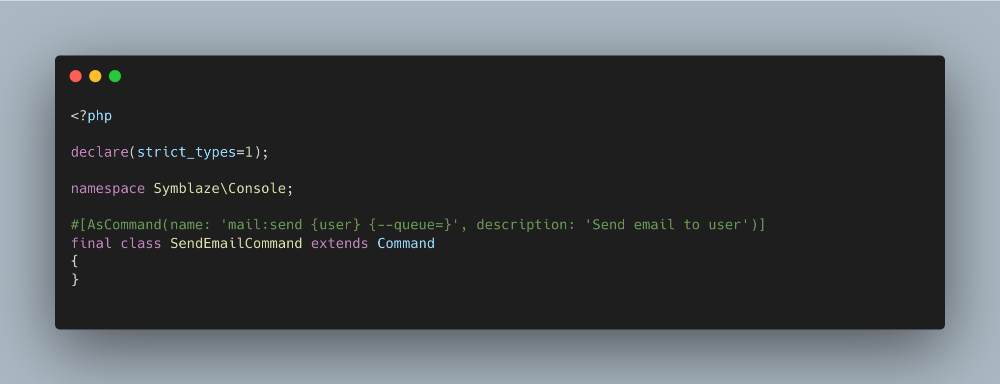

# Symblaze Console

Symfony comes with a powerful console framework that eases the creation of command line interfaces, however,
configuring the console command options and arguments can be a bit tedious, especially because you have to write
multiple lines of code for each command you want to create, and that configuration is not part of the business logic
that you want to implement.

Symblaze Console is a library that allows you to configure your console commands using the Symfony `AsCommand`
attribute. It's inspired by the Laravel Artisan console, and it's built on top of the Symfony console component.

## ❌ Before 😝



- Multiple lines of code for each command.
- Multiple imports that doesn't belong to the business logic.
- A Configuration method that doesn't belong to the business logic.

## ✅ After 💅



- A single line of code for each command.
- No configuration method.
- Focus on the business logic.

## Installation

```bash
composer require symblaze/console
```

## Usage

You can find a complete guide on how to use this library in the [documentation](/docs).

## License

Symblaze Console is open-sourced software licensed under the [MIT license](LICENSE).
